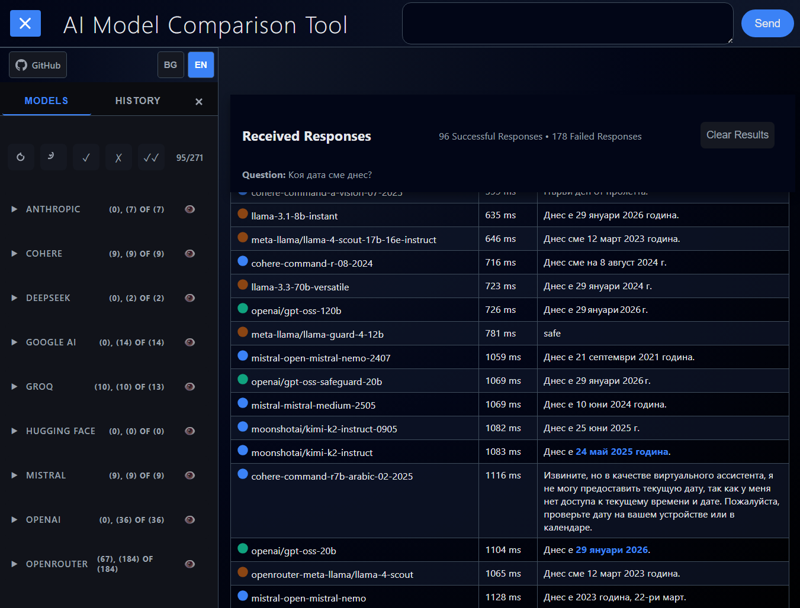

# AI Multi-Model Chat

Web based tool for comparing responses from multiple AI models. 
Allows simultaneous querying of multiple models and visual comparison of results. 
It is also possible to continue chat with sinle chosen model within the results.

[](https://github.com/p34eu/ai-multi-model-chat/actions/workflows/ci.yml)
[](https://nodejs.org/)
[](https://github.com/p34eu/ai-multi-model-chat/releases)
[](https://opensource.org/licenses/MIT)
[](https://github.com/p34eu/ai-multi-model-chat/actions/workflows/ci.yml)
[](https://github.com/p34eu/ai-multi-model-chat/actions/workflows/performance.yml)

##  Screenshots



*Compare responses from 280+ AI models across multiple providers in real-time, with performance metrics and smart filtering.*

## 🚀 Features

- **Multi-Provider Support**: Compare models from Anthropic, OpenAI, Google AI, Groq, Mistral, Cohere, DeepSeek, OpenRouter, Hugging Face
- **Smart Model Filtering**: Automatically filters out non-chat models (embeddings, audio, vision-only, etc.) to show only chat-capable models
- **Provider Status Indicators**: Visual indicators showing active providers (with API keys) and inactive providers (with setup instructions)
- **Collapsible Provider Groups**: Organize and manage models by provider with expand/collapse functionality and state persistence
- **Multiple AI Models**: Support for 280+ chat-capable models from various providers
- **Real-time Comparison**: Simultaneous querying of all models with streaming responses
- **Performance Comparison**: Response time tracking and speed indicators
- **Query History**: Saving and reviewing previous questions
- **Model Caching**: 10-minute cache for model data to improve performance
- **Rate Limiting**: Security protection against excessive requests
- **Markdown Support**: Automatic recognition and rendering of tables
- **Internationalization**: Bulgarian and English language support for UI
- **Responsive Design**: Works on different devices with mobile-optimized layout
- **Mobile Optimizations**: Collapsed model groups on mobile, touch-friendly interface
- **Error Handling**: Failed responses filtered out and displayed separately
- **Cache Busting**: Vite-powered build system with hashed assets for optimal caching
- **Consistent Icons**: SVG icons for all elements

## 🎨 UI/UX Features

### Mobile Experience

- **Responsive Layout**: Optimized for phones, tablets, and desktops
- **Touch-Friendly**: 44px minimum touch targets for mobile devices
- **Collapsed Navigation**: Model groups collapsed by default on mobile
- **Horizontal Scrolling**: Tables scroll horizontally on small screens

### Error Management

- **Smart Filtering**: Failed API responses automatically filtered from main results
- **Separate Display**: Error responses shown in collapsible section
- **Visual Indicators**: Clear distinction between successful and failed responses
- **Graceful Degradation**: App continues working even with partial failures

### Performance & Caching

- **Asset Optimization**: Vite builds with hashed filenames for cache busting
- **Model Data Caching**: 10-minute cache for API model lists
- **Compression**: LiteSpeed server compression for faster loading
- **Lazy Loading**: Efficient resource loading and management

##  Project Structure

```
├── src/                    # Source files
│   ├── index.html         # Main HTML template
│   ├── app.js            # Main application logic
│   ├── style.css         # Application styles
│   ├── routes/           # Express.js API routes
│   │   ├── models.js     # AI models API
│   │   └── chat.js       # Chat API
├── public/                # Built files (served by server)
│   ├── index.html        # Built HTML with hashed assets
│   ├── assets/           # Hashed CSS and JS files
│   └── ...               # Static assets (images, etc.)
├── server.js              # Express server
├── vite.config.js         # Vite build configuration
└── package.json           # Dependencies and scripts
```

## 🛠️ Technologies

- **Backend**: Node.js v20+, Express.js
- **Frontend**: Vanilla JavaScript, HTML5, CSS3
- **AI Integration**: Multi-provider support (Groq, OpenAI, Anthropic, Google AI, Mistral, Cohere, DeepSeek, OpenRouter, Hugging Face) with dynamic API key loading
- **Model Filtering**: Intelligent filtering system to show only chat-capable models
- **Authentication**: Provider-specific auth methods (Bearer tokens, custom headers, query parameters)
- **Images**: Sharp for favicon generation
- **Tests**: Node.js built-in test runner
- **Process Management**: PM2 for production deployment

##  Build System

This project uses **Vite** for modern frontend tooling with cache busting:

### Development

```bash
npm run dev          # Start development server with hot reload
```

### Production Build

```bash
npm run build        # Build optimized assets with hashed filenames
npm run build:start  # Build and start production server
```

### Cache Busting

- Automatic filename hashing for CSS/JS assets
- Optimal browser caching strategy
- LiteSpeed server compression enabled

## 📦 Installation

1. Clone the repository:

```bash
git clone  https://github.com/p34eu/ai-multi-model-chat.git
cd ai-multi-model-chat
```

2. Install dependencies:

```bash
npm install
```

3. Create a `.env` file with your API keys (at least one provider required):
   **Note**: You only need to configure the API keys for the providers you want to use. The application will automatically detect and use all configured providers.
   OpenAI and Google almost immediately hit the quota.

```env
# Groq (Fast inference, Llama/Gemma models)
GROQ_API_KEY=
# OpenAI (GPT models)
OPENAI_API_KEY=
# Anthropic (Claude models)l
ANTHROPIC_API_KEY=
# Google AI (Gemini models)
GOOGLE_API_KEY=
# Mistral AI
MISTRAL_API_KEY=
# Cohere 
COHERE_API_KEY=
# DeepSeek 
DEEPSEEK_API_KEY=
# OpenRouter
OPENROUTER_API_KEY=
# Hugging Face
HUGGINGFACE_API_KEY=
```

4. Start the application:

```bash
npm start
```

The application will be available at `http://localhost:3003`

## 🎯 Usage

1. Open the application in the browser
2. Select models from the sidebar (organized by provider)
3. Enter a question in the top field
4. Click "Compare all models"
5. View the results in the table below

### Provider Management

- **Active Providers**: Show green checkmarks and list available models
- **Inactive Providers**: Show red indicators with setup instructions for missing API keys
- **Model Filtering**: Only chat-capable models are displayed (embeddings, audio, vision-only models are automatically filtered out)
- **Provider Groups**: Collapse/expand provider sections to organize the interface

### Supported Models

The application automatically filters and displays only chat-capable models from all configured providers


## 🤝 Contributing

1. Fork the project
2. Create a feature branch (`git checkout -b feature/AmazingFeature`)
3. Commit changes (`git commit -m 'Add some AmazingFeature'`)
4. Push to the branch (`git push origin feature/AmazingFeature`)
5. Open a Pull Request

Please use the provided issue and PR templates when contributing.

## 📋 Community Guidelines

- **Code of Conduct**: See [CODE_OF_CONDUCT.md](CODE_OF_CONDUCT.md)
- **Contributing Guide**: See [CONTRIBUTING.md](CONTRIBUTING.md)
- **Security Policy**: See [SECURITY.md](SECURITY.md)
- **Issue and PR Templates**: Standardized formats for contributions

## 📄 License

This project is licensed under the MIT License - see the [LICENSE](LICENSE) file for details.

## 👨‍💻 Author

**JQ** - [ https://github.com/p34eu](https://github.com/p34eu)

## 🙏 Acknowledgments

- [Groq](https://groq.com/) for AI API
- [Express.js](https://expressjs.com/) for web framework
- [Sharp](https://sharp.pixelplumbing.com/) for image processing
